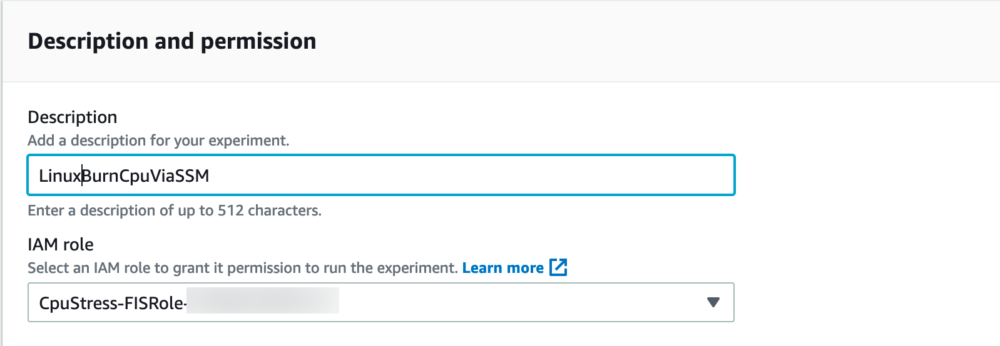
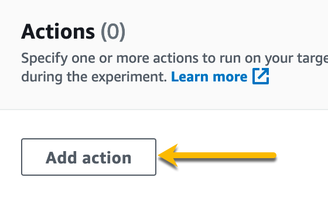
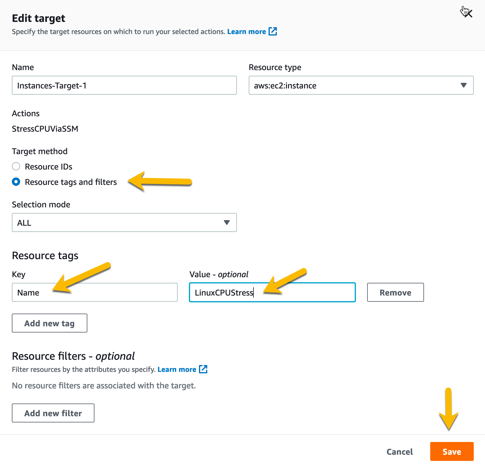
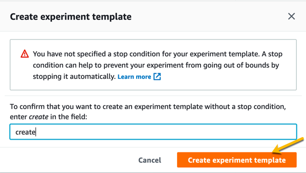
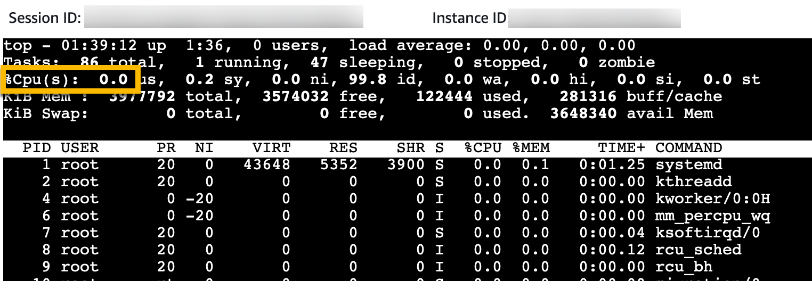
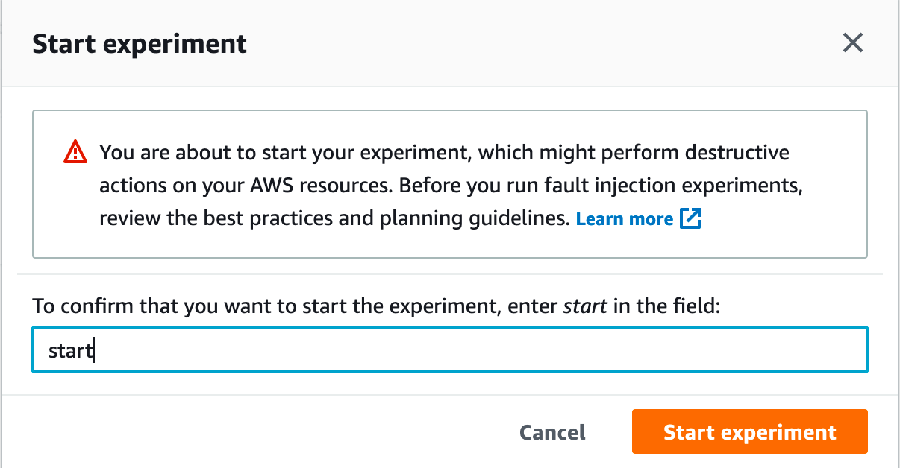

+++
title = "Linux CPU Stress Experiment"
date =  2021-07-07T17:25:37-06:00
weight = 20
+++

In this section we will run a CPU Stress test using AWS Fault Injection Simulator against an Amazon Linux EC2 Instance. The Linux CPU stress test is an out of the box action. We will do the following: 

1. Create experiment template to stress CPU.
2. Connect to an EC2 Instance and Run the Top Command.
3. Start experiment and observe results.

## Create CPU Stress Experiment

First, lets create our stress experiment. We can do this programmaticaly but we will walk through this on the console. 
Open the [AWS Fault Injection Simulator Console](https://console.aws.amazon.com/fis/home?#Home).
Once in the Fault Injection Simulator console, lets click on Experiment templates on the left side pane. 

Click on Create Experiment on  the upper right hand side of the console. 

Next we will enter the description of the experiment and choose the IAM Role. As part of the CloudFormation stack a role was created for this experiment that starts with CpuStress-FISRole*, select that role. Please Examine the CloudFormation template for the policies in this role. 

After we have entered a description and a role, we need to setup our actions. Click the Add Action Button in the Actions Section. 

Name the Action, and under Action Type select the AWSFIS-Run-Cpu-Stress. Match the rest of the settings as seen in the next screenshot and then click save. This action will use [AWS Systems Manager Run Command](https://docs.aws.amazon.com/systems-manager/latest/userguide/execute-remote-commands.html) to run the AWSFIS-Run-Cpu-Stress command document against our targets for two minutes. 

Once we have saved the action, let's edit our targets. Click on Edit targets. 

We are going to target our Instances by tag. Match the settings in the next screenshot and click save. 

Once we have actions and targets specified we can click on the create experiment button toward the bottom of the console. 

For this experiment we did not assign a stop condition, for a workshop or lab this is acceptable. However, it would be considered best practice to have stop conditions on your experiemnts do they dont get out of bounds. Because we do not have a stop condition we are being asked to confirm creation of this experiment. Type in create and then hit the create experiment button again to confirm. 

We have created our CPU stress experiment, now lets connect to our EC2 Instance.

## Use AWS Systems Session Manager to connect to Target Instance

We now need to connect to our EC2 Instance so we can observe the CPU being stressed. Head over to the [EC2 Console](https://console.aws.amazon.com/ec2/v2/home?#Instances:instanceState=running). Once at the EC2 Console lets select our instance named CpuStressTest and click on the connect button. 

Select Session Manager and click on Connect.

This will open a session to the EC2 instance in another tab as shown in the next screenshot. Then enter the top command and hit enter. Note that the CPU percentage is at zero. Keep this open, we will come back once we have started our experiment. 

## Run CPU Stress Experiment

Let's head back to the [AWS Fault Injection Simulator Console](https://console.aws.amazon.com/fis/home?#Home).
Once in the Fault Injection Simulator console, lets click on Experiment templates again on the left side pane. 

Select the experiment with the BurnCPUviaSSM description, then click on the Actions button and select Start Experiment. 

Now click on the Start Experiment button. 

Next type in start and click on STart Experiment again to confirm you want to start the experiment. 

This will take you to the experiment, in the detail section of the experiment under state you should see the experiemnt is initializing. Once the experiemnt is running, lets head back to the open session to the EC2 Instance. 

Watch the CPU percentage, it should hit 100% for a few minutes and then return back to 0%. Once we have observed the action we can click the terminate button to terminate our Session Manager session. 

To clean up this lab, delete the CloudFormation Stack named CPUStress.

Congrats for completing this lab! In this lab you walked through running an experiment that took action within an EC2 Instance using AWS Systems Manager.  Using the integration between Fault Injection Simulator and AWS Systems Manager you can run scripted actions within an EC2 Instance. Through this integration you can script events against your applications or run other choas engineering tools and frameworks. 

